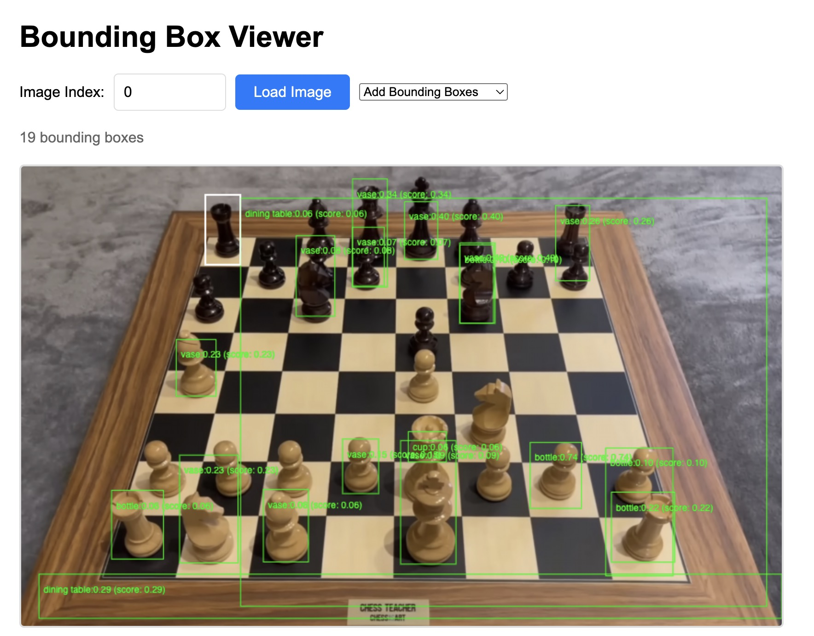
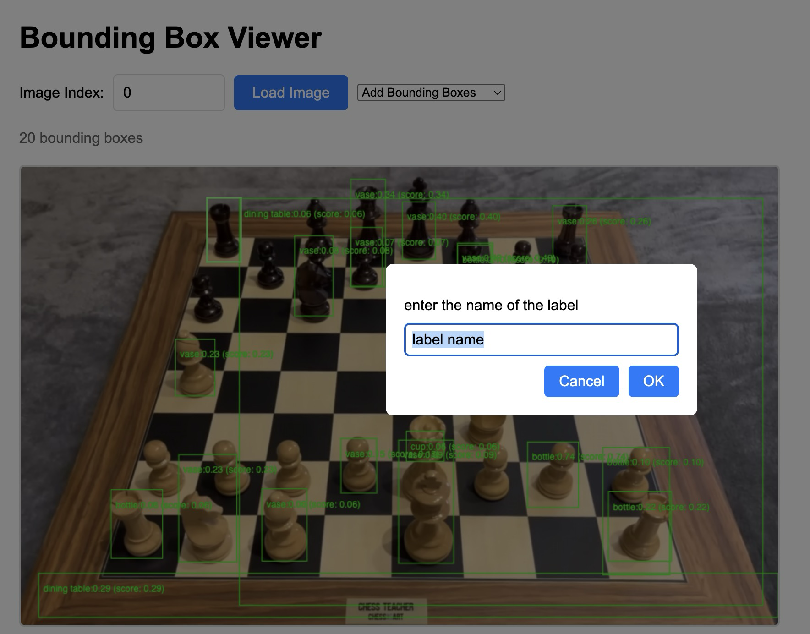

### Object detection labeling software (auto-labeling)
`python version: 3.11.14`

Model-assisted object detection labeling tool with FastAPI, Faster R-CNN, and human-in-the-loop correction for dataset creation.

I started this project to quickly label chess pieces using object detection models (auto-labeling).

Currently the `label.py` script provides a FastAPI server that serves images from the `data/` directory and displays the object detection results from the Faster R-CNN model.

This allows manual correction of the object detection labels and save the corrected labels for training purposes, ultimately building a dataset for model fine-tuning.




## Installation

```bash
pip install -r requirements.txt
```

## Usage
Note: make sure you have a `data/` directory with images in it
```bash
python label.py
```

## Output
localhost:8000

